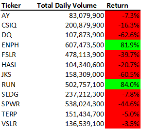

# VBA with Wall Street

## Overview of Project

### Purpose

The purpose of this analysis is to aggregate and summarize daily stock information from 2017-2018 for various renewable energy companies. Analysis outcomes will aid the client in creating a stock portfolio comprised of companies that are most likely to yield profit based on data from previous years.

## Analysis

The data and various analyses can be found in the [VBA Challenge Excel Book](https://github.com/InRegards2Pluto/stock-analysis/blob/f2aeee2939f0b8b3022f2cd403c0431586734524/VBA_Challenge.xlsm).

The following parameters were included in the initial spreadsheet:

- **Ticker**: acronym for company of interest
- **Date**: Date of stock market
- **Open**: Share price at the beginning of the market day
- **High**: Highest share price over the course of the day
- **Low**: Lowest share price over the course of the day
- **Close**: Share price at close of market day
- **Adj Close**: Adjusted share price at close of day
- **Volume**: Number of shares exchanged over the course of the market day

Data for both 2017 and 2018 are included in the "2017" and "2018" workbook tabs, respectively. Tools for analysis are located on the "All Stocks Analysis" tab.

[VBA subroutines](https://github.com/InRegards2Pluto/stock-analysis/blob/f2aeee2939f0b8b3022f2cd403c0431586734524/VBA_Challenge.vbs) were created to provide a user-friendly means to analyze stock data of a given year. Initial subroutines were refactored to optmize the efficiency of analysis. The refactored subroutine prompts a user for the year of interest and then summarizes and aggregates data from the respective year. Total daily volumes for a given company are determined by aggregating daily volumes over the course of a given year. Return percentage is calculated based on the share price at close on the first and last day of the market year. Output values are recorded in columns on the "All Stocks Analysis" tab and color coded red for negative annual returns and green for positive annual returns. Buttons to initiate the subroutine and clear the data are located in the "All Stocks Analysis" tab.

## Results

### Stock Analysis

In 2017, the top three companies with the highest total daily volume were SPWR, FSLR, and CSQI. However, based on the annual return, the top three companies were DQ, SEDG, and ENPH (199.4%, 184.5%, and 129.5%, respetively). With the exception of TERP, all options had positive annual returns in 2017.

<figcaption><i>Fig 1. 2017 All Stocks Analysis</i></figcaption>

In 2018, the top three companies with the highest total daily volume were ENPH, SPWR, and RUN. However, of the entire list of company options, only ENPH and RUN had positive annual returns (81.9% and 84.0%, respectively).

<figcaption><i>Fig 2. 2018 All Stocks Analysis</i></figcaption>

Several conclusions can be drawn from these data. First, a company with relatively high daily exchange volumes doesn't correlate to high returns. For example, in 2017, DQ had the lowest total daily volume, but the highest return. Similarly, while SPWR had the second highest daily exchange volume in 2018, it was in the bottom 3 for annual returns. Given the goal of the client is to maximize the return on their stock portfolio, total daily volume should not be the lone deciding factor on stock choices.

Second, while DQ yielded high returns in 2017, returns plummeted to <-60% in 2018. The client initially expressed interest in DQ being the sole company in their stock portifolio. DQ is not only a risky investment, but a case study for why it's better to diversify a stock portfolio. Numerous factors can cause share prices to skyrocket or plummet, not all of which are visible to investors. As such, investing in multiple companies allows some buffer for when one of them drops in value.

Based on 2017-2018 data, it's recommended that the client invest in ENPH and RUN. Given ENPH's strong performance for 2 consecutive years, it may be wise to split the portfolio 60/40 between the two businesses. 

### Impacts of Refactoring Subroutine
By refactoring the initial subroutine to utilize a series of arrays rather than looping through the data over and over again, processing time was reduced. Processing time was reduced by almost an order of magnitude for both the 2017 and 2018 datasets. While the time saved analyzing this spreadsheet may be negligible, the client is able to use this subroutine to analyze any similarly structured datasheet, even if it contains hundreds of thousands of rows. The time saved in these larger datasets will be far more apparent to the client. 

<figcaption><i>Table 1. Processing time for both original and refactored code</i></figcaption>

| Year  | Original (sec) | Refactored (sec) |
| ------------- | ------------- | ------------- |
| 2017  | [7.42E-1](resources/2017durationModule.png)  | [9.77E-2](resources/2017durationRefactor.png) |
| 2018  | [7.38E-1](resources/2018durationModule.png)  | [1.02E-1](resources/2018durationRefactor.png) |

## Summary
- What are the advantages or disadvantages of refactoring code?
    - An advantage of refactoring code is it (hopefully) reduces the duplication of effort by programmers. Creating code from scratch can be a time-consuming process at best and infuriating at worst. The ability to take existing, working code, and adding a few modifications to increase it's efficiency can save considerable time and headaches.
    - Conversely, a disadvantage of refactoring code is that it may not be well documented and, therefore, challenging to understand and repurpose. If an attempt to refactor the code ends up breaking it, poor documentation of the original code might make it hard to trace back and find the problem. Also, there's the issue that, if the original code utilizes different variable names than what the new programmer is aiming to use, there's a higher risk that not all of the necessary variable names will get updated, resulting in code that won't work. 

- How do these pros and cons apply to refactoring the original VBA script?
    - In the case of refactoring the original VBA script, I was able to utilize a lot of the code from the module exercise, which cut down on time significantly. As I stumbled across instructions for the various for loops, I had several moments of "Oh! This is basically the same thing as what we did before." I would then go and copy and paste the old code and then made the necessary modifications rather than having to type everything out again. Also, as described above, refactoring the original code yielded much faster processing times.
    - On the other hand, when I pulled some of the code from the module exercise to refactor for the challenge project, my variable names from the module were slightly different than those in the initial challenge code. Because the names were close enough to each other, I didn't catch the difference initially. Then, when I tried to run the code, I ended up running into several errors of variables not being defined. I eventually realized my mistake and fixed everything, but it highlighted one of the risks of refactoring existing code.
    - Similarly, while the refactored code is much faster, the original code was a little more intuitive to follow. Even if it wasn't as efficient, line by line everything was pretty straightforward. While refactoring, I ended up tripping over myself a few times while trying to utilize the tickerIndex variable as an index. I ran into a few instances of type mismatches because I misdefined what tickerIndex was. I originally had it calling the tickerIndex as the ticker value instead of the index number (i.e. "AY" instead of "0"). I kept getting errors and had to slowly work through what every line of code was calling before I realized the mistake. Therefore, while the refactored code is more efficient, the underlying mechanics are a bit more complex and, therefore, it's easier to end up breaking the code.
